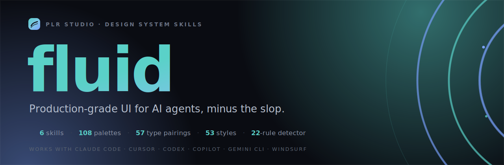

<p align="center">
  <a href="https://fluid.plrstudio.fr">
    
  </a>
</p>

<p align="center">
  <b>6 skills, 108 palettes, 53 styles, 14 layouts, a 25-rule detector, and one house motion language.</b><br>
  Agent skills that build distinctive, production-grade web interfaces, the opposite of generic AI slop.
</p>

<p align="center">
  <a href="https://fluid.plrstudio.fr"><b>Live showcase</b></a> ·
  <a href="https://fluid.plrstudio.fr/docs">Docs</a> ·
  <a href="https://www.npmjs.com/package/fluid-skills">npm</a>
</p>

<p align="center">
  
  
  
  
</p>

<p align="center">
  
  
  
  
</p>

---

An AI can scaffold a UI in seconds, but it converges on the same look: Inter, a purple gradient, default shadcn, bouncy easings, pure black. `fluid` pushes the other way. It gives an agent a committed identity, a signature motion language, and a deterministic guardrail, so the work ships looking like a studio made it, not a template.

The rules and components are distilled from real production work, not from a starter kit.

## Quick start

```bash
npx fluid-skills install
```

It detects your agent (Claude Code, Cursor, Copilot, Codex, Gemini, Windsurf, OpenCode) and drops the six skills in. Then tell your agent what to build: it loads the right skill on its own, `design-system` to set an identity, `fluid` for motion, the detector to check itself before calling anything done.

Prefer the skills registry? `npx skills add Darcos-Loft/fluid` works too.

On Claude Code, add it as a plugin marketplace instead: `/plugin marketplace add Darcos-Loft/fluid`, then `/plugin install fluid@fluid`.

## Why fluid

Generic output is not a taste problem, it is a convergence problem. Every model reaches for the same safe defaults, so every site lands in the same place. Fixing it after the fact is slow and never quite works.

`fluid` fixes it at the source:

- **A unique identity per project.** `design-system` commits to one palette, one type pairing, one style direction, one page shape, picked from a large curated database before it improvises. Same house DNA, different result every time.
- **Motion that feels intentional.** `fluid` is a house motion language: when to animate, which easing, how long, where the spring goes, and the reduced-motion path shipped in the same change.
- **A guardrail that does not rely on taste.** The detector greps the code for the tells of generic work and flags them with a line number and a fix. It runs with zero dependencies and zero API calls, so it can gate CI.

## What's new in v0.2

- **The family grew to six skills.** `redesign`, `brandkit`, `refine` (a vocabulary of 20 named moves), and `output` join `fluid` and `design-system`.
- **The database doubled.** 108 palettes, 57 type pairings, 53 style directions, plus two new libraries the `init` commits to: 14 page-layout archetypes and 10 build stacks, so generated pages vary their *shape*, not just their palette.
- **The detector reached 25 rules.** New layout, look, and glassmorphism tells (numbered section markers, the hero eyebrow chip, oversized type, frosted-glass backdrop-blur) on top of the motion and generic-font checks.

See the full [changelog](./CHANGELOG.md).

## The six skills

| Skill | What it does |
|---|---|
| **`design-system`** | The identity factory. From a short brief it generates a unique design system in the house DNA: tokens, a Tailwind config, a brand rules doc the agent obeys, a storybook, a spec. Picks from the database first, then commits. |
| **`fluid`** | The motion language. Easing map, durations, springs, origins, reduced-motion, plus a drop-in React component library (`SmoothScroll`, `ScrollProgress`, `Reveal`, `Odometer`, `AmbientField`, `Marquee`) and the detector. |
| **`redesign`** | Audit an existing site and ship a fresh identity, preserving content, routes, and SEO. Pairs with `design-system` and the detector. |
| **`brandkit`** | Generate premium reference imagery (logo concepts, palette and type boards, product mockups) for a brand. Works with any image model. |
| **`refine`** | The verb layer. A vocabulary of named moves you run on UI that already exists (`typeset`, `colorize`, `animate`, `settle`, `glass`, `deslop`, `brandward`, `polish`, and more). "Make it better" becomes precise and repeatable. |
| **`output`** | The last gate before shipping: no placeholders, every interactive state handled, the brief honestly met. |

## The database

`design-system` does not improvise an identity from a blank page. It picks from a curated database first, the same way a studio reaches for a known-good combination, then commits to one per project. The DNA stays constant, the output varies.

| Library | Count | What it holds |
|---|--:|---|
| Palettes | **108** | committed color systems across 20+ sectors and moods |
| Type pairings | **57** | distinctive display + text + mono combinations |
| Style directions | **53** | neo-brutalist, aurora mesh, claymorphism, editorial maximalism, cinematic dark, high-contrast a11y, and more |
| Page layouts | **14** | page-shape archetypes, so pages vary their silhouette instead of converging on split-hero-plus-three-cards |
| Chart types | **32** | which chart for which question, with house data-viz defaults |
| Tech stacks | **10** | one committed build stack per project type, wired to the tokens |

Plus a motion-preset library in the house easings. The lesson behind it: varying the palette is not enough, generated pages also share a *shape*, so the layout and stack are committed too.

## The detector

A deterministic scanner for the anti-patterns the rest of the suite teaches. No API calls, no model: it reads source for motion and generic-look smells, with line numbers, severity, and a fix hint.

```bash
npx fluid-skills detect <path>           # audit a folder or file
npx fluid-skills detect <path> --deep    # add the DOM pass (jsdom)
npx fluid-skills detect <path> --strict  # exit 1 on warnings (CI)
npx fluid-skills detect <path> --json    # machine output
```

**25 rules**, zero dependencies, across two families:

- **Motion smells:** `transition: all`, animating layout properties, `ease-in` on enters, `scale(0)`, long durations, dated bounce eases, low-damping springs, plus a project-level check for a missing `prefers-reduced-motion` path.
- **Generic-look tells:** Inter/Roboto/Arial as a primary font, the cliche purple gradient, pure black, emoji used as icons, template components (Aceternity/Magic UI/21st/motion-primitives) shipped verbatim, Space Grotesk overuse, gradient text, frosted-glass backdrop-blur, justified body, tiny text, em-dash typography, crushed tracking, marketing buzzwords, numbered section markers, the hero eyebrow chip, oversized type.

**`--deep` adds 6 DOM-aware rules** the regex pass cannot see (via jsdom, opt-in so the core stays dependency-free): heading-order skips, multiple `h1`, cards nested in cards, repeated icon-tile feature grids, unbounded line length, and a best-effort contrast check on literal colors.

Suppress a line with `fluid-disable-line`, configure with `fluid.config.json`. Rules live in `fluid/detector/rules.mjs` (and `deep.mjs`) as plain arrays, extend them as your house ruleset grows. Exit code is 1 on an error (or any warning under `--strict`), so it gates CI. No npm? `node fluid/detector/detect.mjs <path>` runs the same engine.

## The CLI

One command, three jobs. Published as [`fluid-skills`](https://www.npmjs.com/package/fluid-skills) on npm, so nothing to clone.

```bash
npx fluid-skills install    # drop the 6 skills into your agent (auto-detected)
npx fluid-skills detect .   # lint a project for AI-slop tells
npx fluid-skills hooks      # run the detector on every edit in Claude Code
```

`install` detects the agents present in your project and copies the skills into each. `hooks` wires the detector into Claude Code as a non-blocking edit hook, so the slop tells surface the moment you write them, not at review time.

## The pipeline

```
direction        the aesthetic point of view
design-system    a UNIQUE identity per project     <- kills the generic look at the source
fluid            signature motion
detector         a deterministic guardrail
```

## Works with everything

**Any agent.** It is a `SKILL.md` skill, so it loads in Claude Code, Cursor, Codex, GitHub Copilot, Gemini CLI, OpenCode, Windsurf, and any harness that reads the skills format.

**Any stack.** The design system is pure CSS variables (`tokens.css`), which work in React, Vue, Svelte, Astro, SvelteKit, or plain HTML, with a Tailwind config for Tailwind projects. The easing tokens are framework-agnostic CSS; the `fluid` components are React reference implementations, and the same principles (ease-out, spring damping and response, reduced-motion) translate to Vue, Svelte, SwiftUI, and Flutter. The detector scans CSS, SCSS, HTML, JSX/TSX, Vue, Svelte, and Astro.

## Install

The quick start above installs the whole suite. To add one skill at a time:

```bash
npx skills add Darcos-Loft/fluid -s design-system
npx skills add Darcos-Loft/fluid -s fluid
npx skills add Darcos-Loft/fluid -s redesign
npx skills add Darcos-Loft/fluid -s brandkit
npx skills add Darcos-Loft/fluid -s refine
npx skills add Darcos-Loft/fluid -s output
```

Or copy a skill folder straight into your agent's skills directory (`.claude/skills/`, `.cursor/`, etc).

## Example

`examples/bitcoin/` is a complete design system generated by `design-system`: orange `#f7931a` + mint + gold, Cabinet Grotesk + Satoshi + JetBrains Mono, dark-first. Open `storybook.html` to see it. It clears the detector with no errors or warnings.

## Star history

<a href="https://star-history.com/#Darcos-Loft/fluid&Date">
  
</a>

## License

MIT, see [LICENSE](./LICENSE). By Paul Rolland (PLR Studio).
